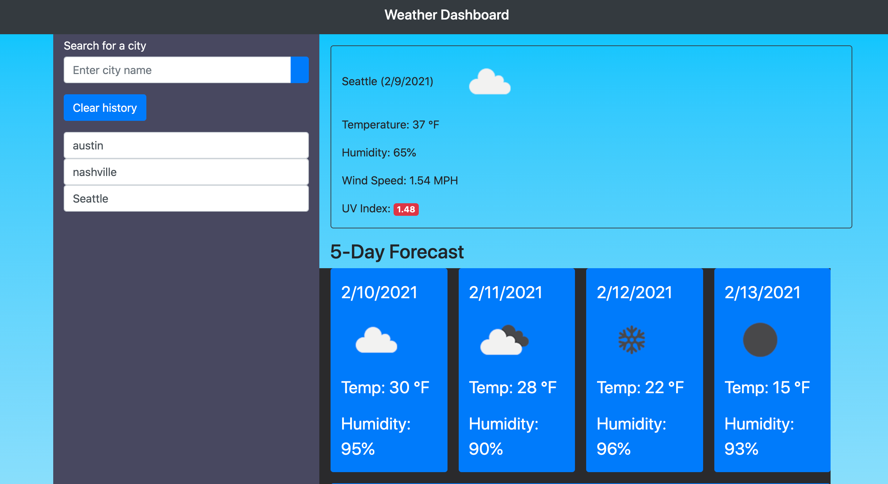

# WeatherDashboard

<h2>A Fix For Your Weather Worries<h2>
  
<h4>Description<h4>

In our weather dashboard app you can get the run down on your current city and any where you wish to travel. The user can simply type in the name of a city and we will fetch the info from our openweathermapAPI.

<h4>Purpose<h4>

 
This assignment was meant to build my skills in using a third-party API source to fetch data for my app to use. 

 
  https://patrickstutts.github.io/WeatherDashboard/
  ; 
  
